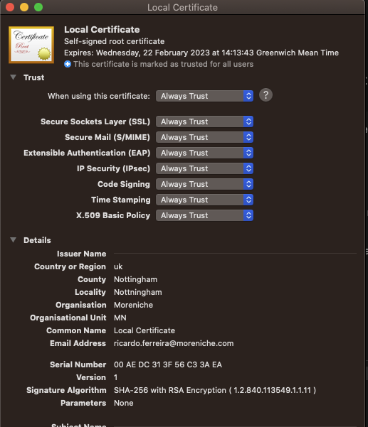

# One Time FIrst Step  
### this is optional you can use perms already in the repo  
<br>  

#### Generate key for creating a perm**
```
openssl genrsa -des3 -out rootCA.key 2048
```

 #### Generate perm for that will be added to the key chain**

 ```
openssl req -x509 -new -nodes -key rootCA.key -sha256 -days 1024 -out rootCA.pem
 ```

You will be prompted with a series a questions where you should respond as the accordingly to the follow example,
```
Country Name (2 letter code) []:uk
State or Province Name (full name) []:Nottingham
Locality Name (eg, city) []:Nottningham
Organization Name (eg, company) []:Moreniche
Organizational Unit Name (eg, section) []:MN
Common Name (eg, fully qualified host name) []:Local Certificate
Email Address []:your.email@moreniche.com
```

All done you should now add the generated RooCa.perm file generated to the key chain and give it full access

after this add the rootCA.pem to the keyChain and give it  full access.  
e.g. :
<br>
<br>


<br>
<br>

#
# Generating ssl certificates  for a site
Note:\
If using the rootCA.perm in the repo just add it to the  keyChain and use the password ```moreniche``` to generate new ssl certificates.

In the repo there is also 3 certificates,  2 for the network ( *mixi.local & *moreniche.local ) and another for wordPress sites ( *.wpdev.com ).  
***If using this certificates don't forget to had the the rootCA.perm to the keyCain and set it to Always Trust.***

### step 1
Update server.srv.conf to meet your needs.  
You should only need to change the following lines:  
```
emailAddress=ricardo.ferreira@moreniche.com
CN = *.moreniche.local
```
CN => Canonical name , use  ( * ) wildcard if needed.
### step 2
Update v3.ext file 
You should only need to change the following lines:  
```
[alt_names]
DNS.1 = moreniche.local
DNS.2 = *.moreniche.local
```
You can use only one domain  DNS.1  and additional subdomains DNS.2 , DNS.3 and so on.  you can also use a ( * ) wildcard to include all subdomains.

### step 3
Replace the domainName.local with the wanted domain for the SSL certificate and run the following command.

```
openssl req -new -sha256 -nodes -out server.csr -newkey rsa:2048 -keyout domainName.local.key -config <( cat server.csr.cnf )
```


### step 4
Replace the domainName.local with the wanted domain for the SSL certificate and run the following command.
```
openssl x509 -req -in server.csr -CA rootCA.pem -CAkey rootCA.key -CAcreateserial -out domainName.local.crt -days 500 -sha256 -extfile v3.ext

```

### step 4
Delete server.csr file as its no longer needed
rm  server.csr

### step 4
Move  domainName.local.crt and domainName.local.key to the cert folder  ```easydock/services/proxy/certs```


Note : it may be required a restart off the reverse proxy server.
